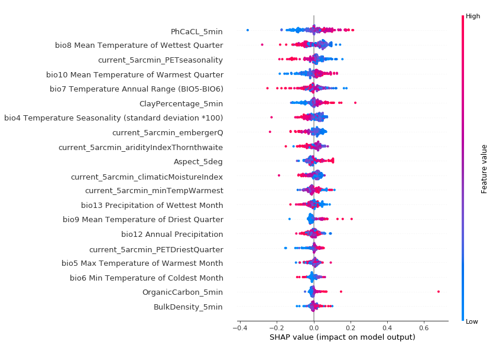
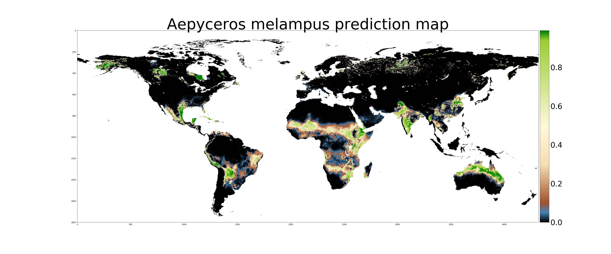

Pilot results
===========

The global performance metrics of the pilot DNN model can be found in the [\_DNN_performance](\_DNN_performance) folder. Next to this there is a separate folder for each species. These folders contains two categories of files. The first category pertains to the species-specific DNN model parameters and weight files for reproducibility and evaluation. These are contained in the .h5, model.json and feature_impact.png files. Next to this, each species folder contains a map with the filtered occurrences from GBIF, a Geotiff with predicted distributions and a resized color map for enhanced visualization. 

If we take the [Impala](Aepyceros_melampus) as an example, we can see that its known occurrences are located in South-Eastern Africa (top image). The DNN model assigned most weight to the variable PhCACL (Soil pH), Mean temperature of the Wettest Quarter and PETSeasonality (montly variability in evapotranspiration) as seen in the middle image. The figure illustrates how each variable impacts the predicted model output and each dot represents a single sample from our test dataset. We can see that a high pH value will have a positive impact on the predicted probability of occurrence, whereas high seasonality  and high temperature in the wettest quarter have a negative impact on predicted probability of occurrence. For each individual sample, the unique combinations between the various variable impacts results in the final predicted probability for a given cell, and the resulting world-wide predicted distribution can be seen in the bottom image.

Known occurrences          |  Variable importance and impact  |
:-------------------------:|:-------------------------:
  |   |

And the resulting map    |    
:-------------------------:
 |

